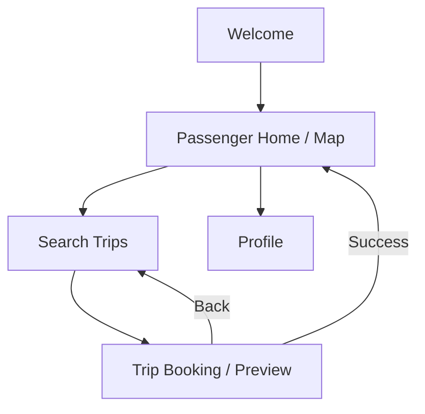
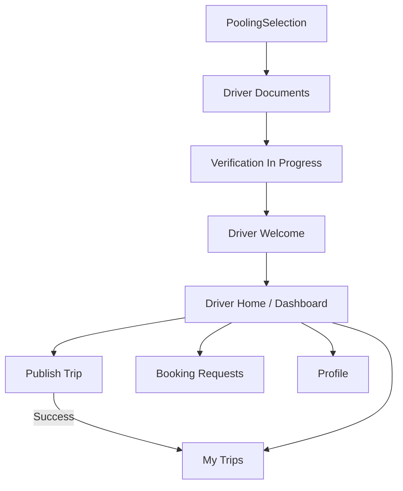

# Google Maps Migration & Page Workflow Guide

This document outlines the steps to add Google Maps API keys, replace the existing Leaflet implementation, and provides a visual workflow of the application's pages.

## 1. Application Page Workflow

The following diagrams illustrate the navigation flow for both Passenger and Driver roles.

### Overall Authentication Flow
```mermaid
graph TD
    Splash[Splash Screen] --> Onboarding[Onboarding]
    Onboarding --> RoleSelection[Role Selection]
    
    RoleSelection -->|Select Role| AuthSelection[Auth Selection]
    
    AuthSelection --> Login[Login (Email)]
    AuthSelection --> Signup[Signup (Email)]
    AuthSelection --> PhoneLogin[Phone Login]
    PhoneLogin --> OTPVerification[OTP Verification]
    
    Login -->|Success| RoutingLogic{Check Role}
    Signup -->|Success| RoutingLogic
    OTPVerification -->|Success| RoutingLogic

    RoutingLogic -->|Passenger| Welcome[Welcome Screen]
    RoutingLogic -->|Driver| PoolingSelection[Pooling Option Selection]
```

### Passenger Flow


### Driver Flow


---

## 2. How to Add Google Maps API Keys

To use Google Maps instead of Leaflet, you must obtain an API key from the Google Cloud Platform (GCP).

### Step 1: Get the API Key
1.  Go to the [Google Cloud Console](https://console.cloud.google.com/).
2.  Create a **New Project** (e.g., "Xpool Maps").
3.  Navigate to **APIs & Services** > **Library**.
4.  Search for and **Enable** the following APIs:
    *   **Maps JavaScript API** (Required for the map itself)
    *   **Places API** (Recommended for location search/autocomplete)
    *   **Directions API** (Required for drawing routes/lines between points)
    *   **Geocoding API** (Optional: For converting coords to addresses)
5.  Go to **APIs & Services** > **Credentials**.
6.  Click **Create Credentials** > **API Key**.
7.  **Copy** the generated key.

> [!IMPORTANT]
> **Security Best Practice:** Click "Edit API key" and under "Application restrictions", select "HTTP referrers (web sites)" and add your formatted localhost URL (e.g., `http://localhost:5173/*`) and your production domain. This prevents others from stealing your quota.

### Step 2: Add Key to Project
Since this is a **Vite** project, you should store the key in an environment variable.

1.  Create a file named `.env` in the root of your project (`g:\xpool\.env`).
2.  Add the key with the `VITE_` prefix:
    ```env
    VITE_GOOGLE_MAPS_API_KEY=your_copied_api_key_here
    ```

---

## 3. Ways to Replace Leaflet

You can replace Leaflet (`react-leaflet`) with a dedicated Google Maps library for React. The recommended approach is **@vis.gl/react-google-maps**.

### Option A: @vis.gl/react-google-maps (Recommended)
This is the modern, official-like library for Google Maps in React.

1.  **Uninstall Leaflet:**
    ```bash
    npm uninstall leaflet react-leaflet leaflet-routing-machine
    ```
2.  **Install Google Maps Library:**
    ```bash
    npm install @vis.gl/react-google-maps
    ```
3.  **Implementation Example (`PassengerHome.jsx`):**
    ```jsx
    import { APIProvider, Map, Marker } from '@vis.gl/react-google-maps';

    const PassengerHome = () => {
      // ... state logic ...
      
      return (
        <APIProvider apiKey={import.meta.env.VITE_GOOGLE_MAPS_API_KEY}>
          <div style={{ height: '100vh', width: '100%' }}>
            <Map
              defaultCenter={{ lat: 19.0760, lng: 72.8777 }}
              defaultZoom={15}
              gestureHandling={'greedy'}
              disableDefaultUI={true} // Clean look
            >
              <Marker position={{ lat: 19.0760, lng: 72.8777 }} />
            </Map>
          </div>
        </APIProvider>
      );
    };
    ```

### Option B: @react-google-maps/api (Alternative)
A very popular, stable community library, heavily used in older projects but still reliable.

1.  **Install:**
    ```bash
    npm install @react-google-maps/api
    ```

2.  **Implementation Example:**
    ```jsx
    import { GoogleMap, useJsApiLoader, Marker } from '@react-google-maps/api';

    const containerStyle = { width: '100%', height: '100%' };
    const center = { lat: 19.0760, lng: 72.8777 };

    function MyMap() {
      const { isLoaded } = useJsApiLoader({
        id: 'google-map-script',
        googleMapsApiKey: import.meta.env.VITE_GOOGLE_MAPS_API_KEY
      })

      return isLoaded ? (
        <GoogleMap
          mapContainerStyle={containerStyle}
          center={center}
          zoom={15}
        >
          <Marker position={center} />
        </GoogleMap>
      ) : <></>
    }
    ```

## Recommendation
I recommend using **Option A (@vis.gl/react-google-maps)** as it integrates better with modern React features and provides easier control over advanced markers and camera animations.
